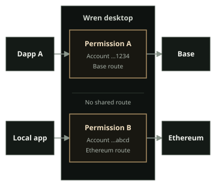

This page explains Wren's product boundary. It does not replace the exact protocol and qualification documents in the [Wren repository](https://github.com/jorphex/wren).

:::caution[Security status]

Wren `0.1.6` and Wren Companion `0.1.2` are published releases. Wren has no independent security audit. Linux x64 is the qualified desktop target. Windows x64 is an unsigned, unqualified preview. macOS x64 and arm64 are ad-hoc signed, unnotarized, and unqualified previews. Use test accounts with no valuable assets until you have evaluated the releases for yourself.

Check the [Wren 0.1.6 release](https://github.com/jorphex/wren/releases/tag/v0.1.6) and [Companion 0.1.2 release](https://github.com/jorphex/wren-companion/releases/tag/v0.1.2) for the artifacts, checksums, compatibility metadata, and source-bound attestations.

:::

## Desktop approval and signing

Wren desktop receives requests from browser dapps and native applications. It reviews and handles supported requests in one desktop interface.

Wren can review:

- account access and permissions;
- network additions and network switches;
- transactions, including calldata and token approvals;
- personal messages, typed data, SIWE-shaped sign-in messages, and token permits;
- non-atomic EIP-5792 wallet calls; and
- selected simulation effects and call-trace evidence from the configured RPC.

Wren normalizes, checks, simulates when available, reviews, signs, and broadcasts supported transactions. It does not make an unsafe request safe by changing its meaning. Review the destination, account, network, amounts, approvals, and calldata yourself. Compare the request with the hardware-device display when the signer supports it.

Queued transactions are read-only while an earlier transaction is active. After Wren submits the current transaction, it opens the next request for review and continues confirmation and reorganization monitoring in the background.

Simulation is evidence from a configured RPC. It is not a guarantee of execution or outcome. Use another trusted review when a simulation fails, is unavailable, is truncated, or is incomplete. Wren requires explicit consent for dangerous legacy `eth_sign` requests.

Support depends on the request and signer. Wren rejects unsupported transaction types and fields instead of silently rewriting them. Type-3 blob transactions are unsupported. EIP-5792 calls are sequential and non-atomic. Permit and SIWE support is review and consent support; Wren does not authenticate a web session or execute a permit contract for you.

Permit reviews show the account, token, amount, network, spender, expiry, and signature type. Token approval reviews keep the requested, custom, unlimited, and revoke choices with the resulting allowance. Transaction reviews group the decoded action, estimated asset changes, editable fees and nonces, contract data, and signer action. Wallet Calls reviews show the starting nonce, maximum batch fee, and transaction fee controls.

See [How Wren protects approvals](https://github.com/jorphex/wren/blob/main/THREAT_MODEL.md), [RPC compatibility](https://github.com/jorphex/wren/blob/main/RPC_COMPATIBILITY.md), and [supported standards](https://github.com/jorphex/wren/blob/main/SUPPORTED_EIPS.md) for the exact method boundary.

## Local wallet and contract tools

Wren can create an encrypted local wallet with a new 12-word recovery phrase or Ethereum private key. It uses the operating system's secure random generator, requires password and backup confirmation, and shows the new secret only during setup. Wren clears an unchanged copied secret from the clipboard after one minute, but clipboard history or another program may retain it.

The dashboard can prepare a contract deployment from complete EVM creation data and an optional native value. Wren does not compile Solidity or Vyper in this tool. It gathers gas, simulation, and nonce evidence from the configured RPC, then uses the ordinary transaction review, signer, and single-broadcast lifecycle.

Wren can also publish Solidity or Vyper source for an existing contract or a confirmed Wren deployment. It reads supported compiler, Foundry, or Hardhat build files locally and checks them against the selected chain and contract. Sourcify is the primary publication service. Etherscan V2 is an optional fallback on supported networks. Published source is public, and Wren cannot withdraw it.

## Per-app permissions and network routes

Wren gives each connected app a separate permission record. A permission can bind an app to selected accounts, permitted wallet methods, enabled chains, the app identity, and an expiry. Wren rechecks standing and queued requests against that record.

An app's network route is separate from every other app's route. An authorized app can switch its own route to an enabled network. The switch does not change another app's route. Wren deliberately has no shared wallet-wide network selection.

Open **Control center** → **Connected apps** to review retained access and default networks. Revoke access when an app no longer needs it. A browser origin and an authenticated local client have different source identities and revocation paths.

See [Manage accounts and addresses](/docs/use-wren/accounts/) and [Manage networks and RPC endpoints](/docs/use-wren/networks/) for the related controls.

## Wren Companion

Wren Companion injects Wren's EIP-1193 provider into supported browser pages and announces it through EIP-6963. It identifies the browser origin and carries the request to Wren desktop.

Companion is not a wallet, signer, or approval authority. It does not need a recovery phrase, private key, keystore password, or hardware-wallet PIN. Wren desktop keeps the account permission, review, signing, and broadcast authority.

Companion `0.1.2` uses mutually authenticated protocol 3. During setup, **Pair this Companion** shows a six-digit code. Compare it with the code in Wren before you select **Accept**. Select **Decline** for an unexpected request or a code mismatch. Matching codes authenticate the installations. They do not make a compromised computer or browser profile safe.

Companion shows **Wren is unavailable** when it cannot reach the desktop. It shows **Update Wren** when the versions do not match. It shows **Wren identity changed** when the saved desktop identity changes.

Do not bypass an update warning. Use **Reset pairing** only when you expect the identity change. Then compare a new code.

Chrome and Brave can install Companion from the [Chrome Web Store](https://chromewebstore.google.com/detail/wren-companion/ifimccfajfbgligbhcgfapdagpnfkbhn). Firefox store review is pending. Verified Chrome and Firefox archives remain available from the [Companion release](https://github.com/jorphex/wren-companion/releases/tag/v0.1.2). The packages are not interchangeable. Companion has no telemetry or remote code. Read the Companion [security policy](https://github.com/jorphex/wren-companion/blob/main/SECURITY.md) and [privacy policy](https://github.com/jorphex/wren-companion/blob/main/PRIVACY.md) for its browser boundary.

## Activity details

Select an Activity row to see its type, result, app, network, account, and exact times. Supported transaction entries can recover methods and transfers from transaction data and confirmed receipts. Wren uses local calldata decoding when remote metadata is unavailable. It checks the retained hash, sending account, and canonical block when available, and labels incomplete evidence instead of guessing.

Wren keeps a small reference ledger for the 90-day Activity window. It stores the activity identity, account, origin, chain, submitted hashes, and an optional canonical block reference. It does not store fetched transaction bodies, calldata, opaque decoded bytes, recipients, or amounts. The ledger is not included in profile backups. See [Review Activity](/docs/use-wren/activity/) for the user controls and clearing boundary.

## Accounts and signers

Open the wallet account selector, then select **Add account**. **Choose an account type** lists these current options:

- **Hardware devices:** **GridPlus Lattice1**, **Ledger device**, and **Trezor device**.
- **Create new:** a new 12-word **Recovery phrase** or Ethereum **Private key**. Wren stores the new local signer in an encrypted signer worker after backup confirmation.
- **Import existing:** **Recovery phrase**, **Private key**, and **Keystore file (JSON)**. Wren stores imported local signer data in encrypted signer workers.
- **Watch-only:** **Watch account**. It can monitor an address but cannot sign.

Linux x64 is the qualified release target. Windows x64 is an unsigned, unqualified preview. macOS x64 and arm64 are ad-hoc signed, unnotarized, and unqualified previews without physical qualification. Trezor Safe 7 and Trezor Model One have current physical evidence on Linux x64, with documented Model One limitations. Ledger and GridPlus Lattice1 have implemented paths and automated coverage, but they have not been physically requalified. Other Trezor models share implementation and automated bridge coverage but have not been physically requalified. Trezor Safe 7 Bluetooth is unsupported.

These labels describe project evidence. They are not security certification. Review [Signer and platform support](https://github.com/jorphex/wren/blob/main/HARDWARE_SUPPORT.md) before you rely on a signer.

## Networks, RPC, and privacy

Wren has no first-party hosted backend. Its default services are explicit and replaceable.

- Built-in networks use PublicNode for EVM RPC by default. The selected RPC receives your IP address and each request, which can include queried addresses, calldata, and submitted signed transactions. Choose **Custom** or **Local** for a network when you need another endpoint.
- Wren requests USD pricing from the DefiLlama Coins API while connected networks are active.
- The embedded Send app loads reviewed content through IPFS.io by default. Wren verifies the pinned directory CID before it activates the content.
- The selected Earn surface requests its fixed vault catalog from Yearn Kong. It does not send account addresses, balances, or transaction details in that catalog request.
- Token artwork comes from a reviewed CoinGecko asset host. Wren does not load arbitrary remote artwork.

Explorers and protocol sites open only after you select them. Wren does not contact Pylon or send account addresses to an NFT indexer. The inherited NFT panel is disabled. See [Network data and privacy](https://github.com/jorphex/wren/blob/main/README.md#network-data-and-privacy) and the [threat model](https://github.com/jorphex/wren/blob/main/THREAT_MODEL.md) for more boundaries.

## Contacts and Earn

Wren stores contacts locally. A saved contact name can appear during request review. It does not change the address or signed payload.

The current **Earn** surface provides a local, allowlisted Yearn catalog on Ethereum, Base, and Katana. It can show positions and run bounded deposit, withdraw, approval, and revoke workflows. A watch-only account can inspect positions but cannot transact. Yearn vaults still have smart-contract and strategy risk. Use the exact [Yearn Earn boundary](https://github.com/jorphex/wren/blob/main/YEARN_EARN.md) for supported products and workflow evidence.

See [Manage tokens](/docs/use-wren/tokens/) and [Use Earn](/docs/use-wren/earn/) for task instructions.

## Backups and profile import

Open **Settings** → **Recovery** to use **Export encrypted backup** or **Restore encrypted backup**. Wren encrypts the profile backup with a password that you choose. Wren cannot recover that password.

Inspect a backup before you replace the current profile. Test restoration with non-valuable accounts. Keep the backup separate from the computer that runs Wren.

Wren also supports a one-time **Import a Frame profile** flow. It copies validated configuration and encrypted signer files through private staging. It does not read or change the active Frame profile. Use the [installation tutorial](/docs/getting-started/install/#import-a-frame-profile) for the required order and checks.

## Current unsupported boundary

The current release does not claim support for:

- macOS, Windows, or Linux arm64 as platform-qualified desktop targets. Windows x64 and macOS x64/arm64 are available only as unqualified previews;
- Trezor Safe 7 Bluetooth;
- smart accounts, ERC-4337 user operations, mobile, or WalletConnect; or
- atomic EIP-5792 execution, EIP-4844 type-3 blob transactions, or externally supplied EIP-7702 authorization input.

Read [Advanced execution boundaries](https://github.com/jorphex/wren/blob/main/EXECUTION_BOUNDARIES.md) before you depend on an advanced transaction path. Read [Signer and platform support](https://github.com/jorphex/wren/blob/main/HARDWARE_SUPPORT.md) before you depend on a device or operating system.
