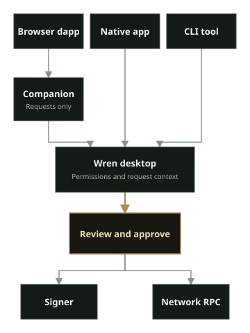

Wren is a desktop EVM wallet and signing firewall for browser dapps and native applications. Wren desktop keeps account permissions, network routes, request review, signing, and broadcast in one place.

Wren Companion connects browser dapps to Wren on the same computer. Companion carries browser requests. It is not a wallet or signer. Wren desktop remains responsible for permissions, review, signing, and broadcast.

:::caution[Security status]

Wren `0.1.6` and Wren Companion `0.1.2` are published releases. Wren has no independent security audit. Linux x64 is the qualified desktop target. Windows x64 is an unsigned, unqualified preview. macOS x64 and arm64 are ad-hoc signed, unnotarized, and unqualified previews. Use test accounts with no valuable assets while you evaluate the releases.

:::

## Start with your task

- Read [Wren features and boundaries](/docs/features/) to understand the current product scope.
- Read the [release notes](/docs/release-notes/) before you update Wren or Companion.
- [Install and start Wren](/docs/getting-started/install/) on Linux x64, or evaluate a Windows or macOS preview. Verify the package before you run it.
- [Complete Wren onboarding](/docs/getting-started/onboarding/) and add a test or watch-only account.
- [Install and pair Wren Companion](/docs/getting-started/companion/) when you need browser dapps. Compare the six-digit code in Companion and Wren before you accept the pairing request.
- Use Wren's local provider for a native application that supports it. Companion is not required.
- [Import a Frame profile](/docs/getting-started/install/#import-a-frame-profile) when you need a one-time private copy of an existing profile. Wren does not read Frame's live profile by default.

After setup, open **Control center**. You can manage [accounts](/docs/use-wren/accounts/), [networks](/docs/use-wren/networks/), [activity](/docs/use-wren/activity/), [tokens](/docs/use-wren/tokens/), [Earn](/docs/use-wren/earn/), and [settings](/docs/use-wren/settings/).

Review the requesting app, account, network, and request details before you approve them.

## What makes Wren different

- Wren gives browser and native clients one desktop approval surface.
- Each connected app has its own permitted accounts and network route. Wren has no shared wallet-wide network switch.
- Wren reviews supported transactions, messages, typed data, permits, and permissions before the signer acts. Simulation and decoded details are evidence. They do not guarantee the result.
- Wren can create a new encrypted local wallet or import an existing local signer. It also supports hardware and watch-only accounts. A watch-only account can inspect data but cannot sign.
- Wren can prepare contract deployments and publish checked Solidity or Vyper source for existing contracts and confirmed Wren deployments. Source publication is public and cannot be withdrawn through Wren.
- Activity rows open detail views. Supported transaction entries can retrieve bounded context from your configured RPC without storing transaction bodies in Activity history.
- Companion carries browser requests and does not need your recovery phrase, private key, keystore password, or hardware-wallet PIN.

Read [Wren features and boundaries](/docs/features/) before you rely on a feature or signer.

## Safety baseline

- Download Wren only from the [Wren release page](https://github.com/jorphex/wren/releases).
- Install Companion for Chrome or Brave from the [Chrome Web Store](https://chromewebstore.google.com/detail/wren-companion/ifimccfajfbgligbhcgfapdagpnfkbhn).
- Use the [Companion release page](https://github.com/jorphex/wren-companion/releases) for a verified local archive or Firefox package.
- Verify release checksums and GitHub artifact attestations before installation.
- Enter a recovery phrase or private key only in Wren's account setup. Never enter one in Companion or a dapp page.
- Export an encrypted Wren profile backup from **Settings** → **Recovery**. Test restoration with non-valuable accounts before you rely on the backup.
- Verify the address on a hardware device when the signer supports address display. Wren's evidence labels are not security certification.
- Report suspected vulnerabilities through the appropriate repository's [Security policy](https://github.com/jorphex/wren/blob/main/SECURITY.md), not a public issue.

## Authoritative technical details

The product repositories define protocol behavior and qualification evidence:

- [Signer and platform support](https://github.com/jorphex/wren/blob/main/HARDWARE_SUPPORT.md)
- [RPC compatibility](https://github.com/jorphex/wren/blob/main/RPC_COMPATIBILITY.md)
- [Supported Ethereum standards](https://github.com/jorphex/wren/blob/main/SUPPORTED_EIPS.md)
- [Advanced execution boundaries](https://github.com/jorphex/wren/blob/main/EXECUTION_BOUNDARIES.md)
- Companion [security policy](https://github.com/jorphex/wren-companion/blob/main/SECURITY.md) and [privacy policy](https://github.com/jorphex/wren-companion/blob/main/PRIVACY.md)
