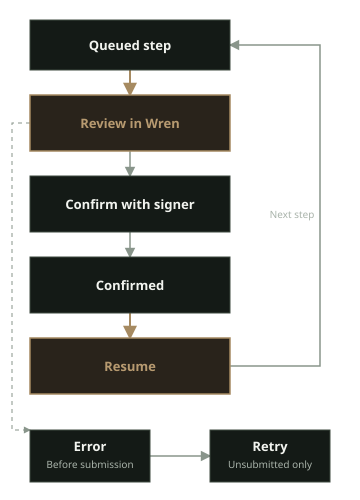

Earn provides a curated Wren view of selected Yearn vaults. It is a transaction interface, not investment advice. Vaults involve smart-contract, strategy, liquidity, and network risks. A displayed APY or TVL is not a promise of return, execution, liquidity, or safety.

## Before you begin

- Enable and connect the network for the vault. Earn supports Ethereum, Base, and Katana.
- Select an account with a signer when you want to deposit, withdraw, stake, or manage a cooldown.
- Keep enough native currency on that network for network fees.

Watch-only accounts can inspect positions but cannot transact. If Wren cannot use the account or network, Earn shows **Select a signing account to transact.**, **Watch-only accounts can inspect positions but cannot transact.**, or a network status message.

When a chain is disabled, its status is **Enable this chain in Wren**. When its RPC is not connected, its status is **Wren is not connected to this chain**. Select **Manage networks** in the status message to open network settings.

## Check current Earn data

1. Open **Control center**.
2. Select **Earn**.
3. Use **All**, **Ethereum**, **Base**, or **Katana** to filter the vault list.
4. Select **Refresh** to request current catalog data.

While data loads, Earn shows **Loading curated Yearn vaults...**. If no catalog is available, it shows **Earn is unavailable.** and **Try again**.

The current Wren catalog contains these products:

| Network | Product | Deposit asset |
| --- | --- | --- |
| Ethereum | yvUSD, **Flexible** or **Locked** | USDC |
| Ethereum | USDS-1 yVault | USDS |
| Ethereum | WETH-1 yVault | WETH |
| Ethereum | Staked yBOLD | BOLD |
| Base | USDC Horizon yVault | USDC |
| Katana | vbUSDC yVault | vbUSDC |
| Katana | vbETH yVault | vbETH |
| Katana | vbUSDT yVault | vbUSDT |

Wren gets vault metadata from Yearn's Kong service. Wren checks the metadata against its local catalog and policy before it enables a deposit. Wren reads balances, vault positions, simulations, and receipts through the configured RPC for each network. Earn does not swap or bridge assets and does not change a dapp's network route.

Cards show **Est. APY**, **Historical APY**, or **Unavailable**, plus **TVL** and a risk label. The values come from current or historical Yearn data. Treat them as third-party data for review only.

If the catalog cannot be refreshed, Earn shows **Showing cached Yearn data. New deposits are disabled; existing positions remain manageable.** or **Showing unavailable Yearn data. New deposits are disabled; existing positions remain manageable.** An unavailable product is withdraw-only when Wren recognizes an existing position.

## Deposit into a vault

1. Select a vault card.
2. Check the network, deposit asset, **Est. APY**, **TVL**, and **Risk**.
3. For yvUSD, select **Flexible** or **Locked** under **Choose how to earn**.
4. For a new yBOLD deposit, use the staked route. Wren finishes the deposit as staked yBOLD.
5. Select **Deposit**.
6. Enter an amount in the displayed asset, or select **Max**.
7. Select **Review Deposit**.
8. Review each Wren request. Check the account, network, target, asset, and amount.
9. Approve the request in Wren and confirm it with the selected signer.
10. After a step confirms, select **Resume** to queue the next step.

Some deposit routes need an approval. Wren requests approval for the exact amount. If an existing allowance is non-zero, Wren first shows **Reset existing approval**, then shows **Approve exactly _SYMBOL_**. Review both requests before you confirm them.

Every Earn transaction opens Wren's simulation and signer review. A simulation is evidence from the configured RPC. It does not guarantee the result after the transaction is mined.

## Withdraw from a vault

1. Select a vault with **Your position**.
2. Select the position variant when the vault has more than one.
3. Select **Withdraw**.
4. Enter the amount in the displayed asset, or select **Max**.
5. Select **Review Withdraw**.
6. Review the simulation and signer request.
7. Confirm the request with the selected signer.
8. Select **Resume** after each confirmed step.

For direct vaults, an exact withdrawal uses **withdraw**. **Max** uses the full share balance with **redeem**. Wren fixes withdrawal loss tolerance at `0%`. Earn has no loss-tolerance or slippage setting.

### Withdraw locked yvUSD

Locked yvUSD has a cooldown and a withdrawal window. Wren reads the duration and window from the locked vault.

1. Select **Start locked cooldown**.
2. Enter the amount to prepare for withdrawal, or select **Max**.
3. Select **Review Start cooldown** and confirm the request.
4. Wait until the withdrawal window opens.
5. Select **Withdraw** and confirm the two-step exit to USDC.

Earn shows **Cooldown in progress**, **Your withdrawal window is open now**, or **The previous withdrawal window closed** with the relevant times. Select **Cancel cooldown** only when you want to return cooling-down shares to the liquid locked position.

### Manage yBOLD

New BOLD deposits finish staked as ysyBOLD. If you already hold unstaked yBOLD, select **Stake existing yBOLD** before you withdraw it. A staked withdrawal returns BOLD through the reviewed Yearn route.

## Track a workflow

Earn shows each queued action in **Earn activity**. It processes one step at a time. Read the step label and status before you select an action.

- Select **Resume** when the next step is ready.
- Select **Retry** only for an unsubmitted step with an error.
- Select **View transaction** to open a confirmed transaction in the network explorer.
- Select **Revoke approval** when Wren shows a confirmed approval that the operation did not use.
- Select **Recheck approval** or **Revoke again** when Wren needs a separate allowance check.
- Select **Close** only when no approval remains to clean up.

Wren does not blindly retry a submitted transaction. If Wren cannot determine whether a request was broadcast after a restart, check the transaction on the network before you replace or retry it.

If a signer is unavailable, Wren shows **Signer unavailable**. Check the signer for the account, make the signer ready, and try again. A watch-only account cannot complete an Earn workflow.

For independent verification, use **View on Yearn (external)** and **View vault contract (external)** in the vault details. These links do not change Wren's review requirements.
