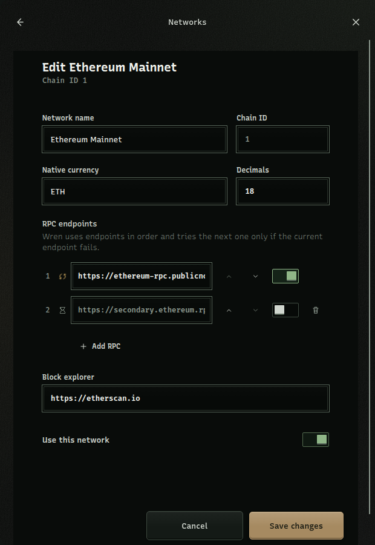

Use **Control center** → **Networks** to manage the EVM networks that Wren can use. A network must be enabled and have an enabled, connected RPC endpoint before Wren can use it for reads or requests.

:::caution[Check every network and endpoint]

Wren `0.1.8` has no independent security audit. Check the chain ID, endpoint host, and connection status before you enable a network or approve a dapp-requested network. Treat endpoint data as a security and privacy decision.

:::

## Enable or disable a network

1. Open **Control center**.
2. Select **Networks**.
3. Select **All** to include disabled networks, or **Active** to show enabled networks.
4. Use the toggle beside a network to enable it.
5. Open the network row and check its **RPC endpoints**.
6. Enable at least one endpoint when its toggle is off.

Wren starts with **Mainnet** enabled. Mainnet is always enabled and cannot be removed. Other built-in networks are available from the same list and can be enabled when you need them.

To disable a network, use its toggle again. Wren moves a connected app that uses the disabled network to **Mainnet**. Check each connected app after you disable a network.

## Set a connected-app network route

Wren does not use one wallet-wide network switch. Each connected app has its own default network route.

1. Open **Control center**.
2. Select **Connected apps**.
3. Select the app.
4. Select an enabled network under **Default network**.

The app keeps this route until you change it. A known app can switch its route to another enabled chain without another approval screen or account exposure. An unknown app, an unknown chain, or a disabled chain fails closed.

If you remove or disable the network that an app uses, Wren changes that app's route to **Mainnet**. Verify the route before you approve the next request.

## Add a custom network

Use a trusted chain definition and an RPC endpoint that you have checked independently.

1. Open **Control center** → **Networks**.
2. Select **Add**.
3. Enter **Network name**.
4. Enter the numeric **Chain ID**.
5. Enter **Native currency** and **Decimals**.
6. Enter the first RPC URL under **RPC endpoints**.
7. Add an optional **Block explorer** URL.
8. Turn on **Test network** when the chain is a test network.
9. Select **Add network**.

The first RPC endpoint is required. Wren accepts up to five endpoints for a network. Manual endpoint entries can use `http://`, `https://`, `ws://`, or `wss://`. Wren does not allow an endpoint that points back to its own local provider at port `1248`.

When a dapp requests a new network, the editor shows **Requested by** and the requesting origin. Verify the origin, chain ID, network details, and RPC URL before you select **Add network**. Dapp-requested RPC URLs must use HTTPS and must not contain credentials.

## Edit a network

1. Open **Control center** → **Networks**.
2. Select the network row.
3. Review **Chain ID** before you change any other field.
4. Edit **Network name**, **Native currency**, **Decimals**, **RPC endpoints**, or **Block explorer** as needed.
5. Use **Use this network** to change network availability.
6. Select **Save changes**.

The existing **Chain ID** is read-only in the editor. If you need a different chain ID, add a new network and verify its details.

Select **Cancel** to leave the editor without saving the network fields. Mainnet has no **Remove network** action.

## Manage RPC endpoint order

Wren tries enabled endpoints in their displayed order. It tries the next enabled endpoint only when the current endpoint fails.

Each row shows a status such as **Connected**, **Checking connection…**, **Can’t connect**, **Not checked**, or **Off**.

1. Edit an RPC URL and leave the field to commit it.
2. Use the endpoint toggle to **Enable RPC endpoint 1** or **Disable RPC endpoint 1**.
3. Use the control that has the applicable row number.
4. Use the up and down controls to change endpoint order.
5. Select **Add RPC** to add another endpoint.
6. Select **Remove RPC endpoint 2** or the matching row control to remove an extra endpoint.

Wren keeps the first endpoint row. You can add no more than five endpoint rows. Check the status after you change a URL or its order. Stop if the status is **Can’t connect** or if the endpoint reports a chain ID that does not match the network you selected.

If the active endpoint fails, Wren can switch to the next enabled endpoint. Review the endpoint order and host before you rely on automatic failover.

## Recheck an OP Stack funding failure

On a recognized OP Stack network, Wren gets fresh L1 fee evidence before approval. If **Send** shows **Funding check unavailable**, check the RPC endpoint and select **Recheck**. Wren refreshes the gas estimate, L1 fee, and balance before it repeats the funding check. It does not sign or broadcast while required evidence is missing or invalid.

For method-level and local-provider behavior, read Wren's [RPC compatibility reference](https://github.com/jorphex/wren/blob/main/RPC_COMPATIBILITY.md). To manage account permissions before you change a route, see [Manage accounts and signers](/docs/use-wren/accounts/).
